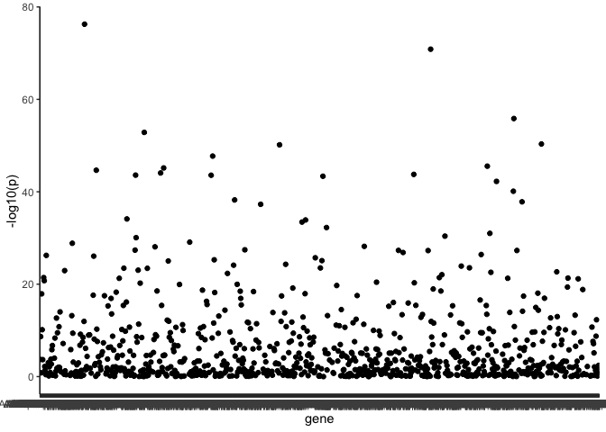

ttsDE
================

**ttsDE**, A tail-based test statistics (TTS) for differentially
expression detection (Paper submitted).

TTS is a tail-based test to identify diffentially expressed genes
between two groups. TTS is a quantile-based model that takes expression
values at exon level, and adjusts for covariates.

# Installation

In R,

``` r
devtools::install_github("SkadiEye/ttsDE")
```

# Example

``` r
library(ttsDE)
## Load LUAD data
data("LUAD")

set.seed(4321)
## Run TTS on LUAD data, tau = 0.5
(a <- Sys.time()) 
```

    ## [1] "2020-07-01 23:28:22 EDT"

``` r
mod1 <- ttsDE(LUAD$z, LUAD$d, LUAD$c, gene = LUAD$gene, tau = 0.5, method = "TTS")
```

    ##   |                                                                              |                                                                      |   0%  |                                                                              |                                                                      |   1%  |                                                                              |=                                                                     |   1%  |                                                                              |=                                                                     |   2%  |                                                                              |==                                                                    |   2%  |                                                                              |==                                                                    |   3%  |                                                                              |==                                                                    |   4%  |                                                                              |===                                                                   |   4%  |                                                                              |===                                                                   |   5%  |                                                                              |====                                                                  |   5%  |                                                                              |====                                                                  |   6%  |                                                                              |=====                                                                 |   6%  |                                                                              |=====                                                                 |   7%  |                                                                              |=====                                                                 |   8%  |                                                                              |======                                                                |   8%  |                                                                              |======                                                                |   9%  |                                                                              |=======                                                               |   9%  |                                                                              |=======                                                               |  10%  |                                                                              |=======                                                               |  11%  |                                                                              |========                                                              |  11%  |                                                                              |========                                                              |  12%  |                                                                              |=========                                                             |  12%  |                                                                              |=========                                                             |  13%  |                                                                              |=========                                                             |  14%  |                                                                              |==========                                                            |  14%  |                                                                              |==========                                                            |  15%  |                                                                              |===========                                                           |  15%  |                                                                              |===========                                                           |  16%  |                                                                              |============                                                          |  17%  |                                                                              |============                                                          |  18%  |                                                                              |=============                                                         |  18%  |                                                                              |=============                                                         |  19%  |                                                                              |==============                                                        |  19%  |                                                                              |==============                                                        |  20%  |                                                                              |==============                                                        |  21%  |                                                                              |===============                                                       |  21%  |                                                                              |===============                                                       |  22%  |                                                                              |================                                                      |  22%  |                                                                              |================                                                      |  23%  |                                                                              |================                                                      |  24%  |                                                                              |=================                                                     |  24%  |                                                                              |=================                                                     |  25%  |                                                                              |==================                                                    |  25%  |                                                                              |==================                                                    |  26%  |                                                                              |===================                                                   |  26%  |                                                                              |===================                                                   |  27%  |                                                                              |===================                                                   |  28%  |                                                                              |====================                                                  |  28%  |                                                                              |====================                                                  |  29%  |                                                                              |=====================                                                 |  29%  |                                                                              |=====================                                                 |  30%  |                                                                              |=====================                                                 |  31%  |                                                                              |======================                                                |  31%  |                                                                              |======================                                                |  32%  |                                                                              |=======================                                               |  32%  |                                                                              |=======================                                               |  33%  |                                                                              |========================                                              |  34%  |                                                                              |========================                                              |  35%  |                                                                              |=========================                                             |  35%  |                                                                              |=========================                                             |  36%  |                                                                              |==========================                                            |  36%  |                                                                              |==========================                                            |  37%  |                                                                              |==========================                                            |  38%  |                                                                              |===========================                                           |  38%  |                                                                              |===========================                                           |  39%  |                                                                              |============================                                          |  39%  |                                                                              |============================                                          |  40%  |                                                                              |============================                                          |  41%  |                                                                              |=============================                                         |  41%  |                                                                              |=============================                                         |  42%  |                                                                              |==============================                                        |  42%  |                                                                              |==============================                                        |  43%  |                                                                              |==============================                                        |  44%  |                                                                              |===============================                                       |  44%  |                                                                              |===============================                                       |  45%  |                                                                              |================================                                      |  45%  |                                                                              |================================                                      |  46%  |                                                                              |=================================                                     |  46%  |                                                                              |=================================                                     |  47%  |                                                                              |=================================                                     |  48%  |                                                                              |==================================                                    |  48%  |                                                                              |==================================                                    |  49%  |                                                                              |===================================                                   |  49%  |                                                                              |===================================                                   |  50%  |                                                                              |===================================                                   |  51%  |                                                                              |====================================                                  |  51%  |                                                                              |====================================                                  |  52%  |                                                                              |=====================================                                 |  52%  |                                                                              |=====================================                                 |  53%  |                                                                              |=====================================                                 |  54%  |                                                                              |======================================                                |  54%  |                                                                              |======================================                                |  55%  |                                                                              |=======================================                               |  55%  |                                                                              |=======================================                               |  56%  |                                                                              |========================================                              |  56%  |                                                                              |========================================                              |  57%  |                                                                              |========================================                              |  58%  |                                                                              |=========================================                             |  58%  |                                                                              |=========================================                             |  59%  |                                                                              |==========================================                            |  59%  |                                                                              |==========================================                            |  60%  |                                                                              |==========================================                            |  61%  |                                                                              |===========================================                           |  61%  |                                                                              |===========================================                           |  62%  |                                                                              |============================================                          |  62%  |                                                                              |============================================                          |  63%  |                                                                              |============================================                          |  64%  |                                                                              |=============================================                         |  64%  |                                                                              |=============================================                         |  65%  |                                                                              |==============================================                        |  65%  |                                                                              |==============================================                        |  66%  |                                                                              |===============================================                       |  67%  |                                                                              |===============================================                       |  68%  |                                                                              |================================================                      |  68%  |                                                                              |================================================                      |  69%  |                                                                              |=================================================                     |  69%  |                                                                              |=================================================                     |  70%  |                                                                              |=================================================                     |  71%  |                                                                              |==================================================                    |  71%  |                                                                              |==================================================                    |  72%  |                                                                              |===================================================                   |  72%  |                                                                              |===================================================                   |  73%  |                                                                              |===================================================                   |  74%  |                                                                              |====================================================                  |  74%  |                                                                              |====================================================                  |  75%  |                                                                              |=====================================================                 |  75%  |                                                                              |=====================================================                 |  76%  |                                                                              |======================================================                |  76%  |                                                                              |======================================================                |  77%  |                                                                              |======================================================                |  78%  |                                                                              |=======================================================               |  78%  |                                                                              |=======================================================               |  79%  |                                                                              |========================================================              |  79%  |                                                                              |========================================================              |  80%  |                                                                              |========================================================              |  81%  |                                                                              |=========================================================             |  81%  |                                                                              |=========================================================             |  82%  |                                                                              |==========================================================            |  82%  |                                                                              |==========================================================            |  83%  |                                                                              |===========================================================           |  84%  |                                                                              |===========================================================           |  85%  |                                                                              |============================================================          |  85%  |                                                                              |============================================================          |  86%  |                                                                              |=============================================================         |  86%  |                                                                              |=============================================================         |  87%  |                                                                              |=============================================================         |  88%  |                                                                              |==============================================================        |  88%  |                                                                              |==============================================================        |  89%  |                                                                              |===============================================================       |  89%  |                                                                              |===============================================================       |  90%  |                                                                              |===============================================================       |  91%  |                                                                              |================================================================      |  91%  |                                                                              |================================================================      |  92%  |                                                                              |=================================================================     |  92%  |                                                                              |=================================================================     |  93%  |                                                                              |=================================================================     |  94%  |                                                                              |==================================================================    |  94%  |                                                                              |==================================================================    |  95%  |                                                                              |===================================================================   |  95%  |                                                                              |===================================================================   |  96%  |                                                                              |====================================================================  |  96%  |                                                                              |====================================================================  |  97%  |                                                                              |====================================================================  |  98%  |                                                                              |===================================================================== |  98%  |                                                                              |===================================================================== |  99%  |                                                                              |======================================================================|  99%  |                                                                              |======================================================================| 100%

``` r
(b <- Sys.time() - a)
```

    ## Time difference of 5.641908 mins

``` r
## Run TTS on LUAD data using 8 cores
(a <- Sys.time()) ## 1.275387 mins
```

    ## [1] "2020-07-01 23:34:00 EDT"

``` r
mod8 <- ttsDE(LUAD$z, LUAD$d, LUAD$c, gene = LUAD$gene, tau = 0.5, method = "TTS", n_core = 8)
(b <- Sys.time() - a)
```

    ## Time difference of 1.180652 mins

``` r
library(ggplot2)
ggplot(data.frame(gene = levels(LUAD$gene), `-log10(p)` = -log10(mod8$TTS), check.names = FALSE), 
       aes(x = gene, y = `-log10(p)`)) + geom_point(na.rm = TRUE) + theme_classic()
```

<!-- -->
